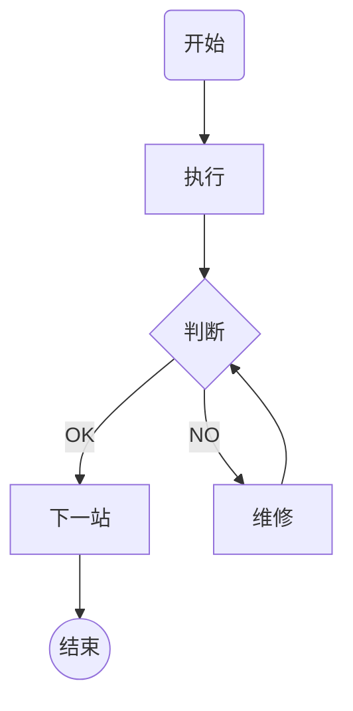
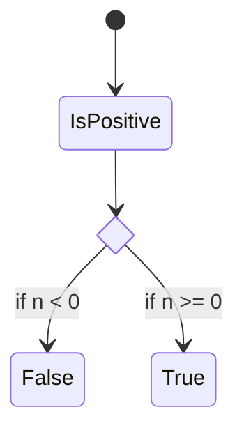
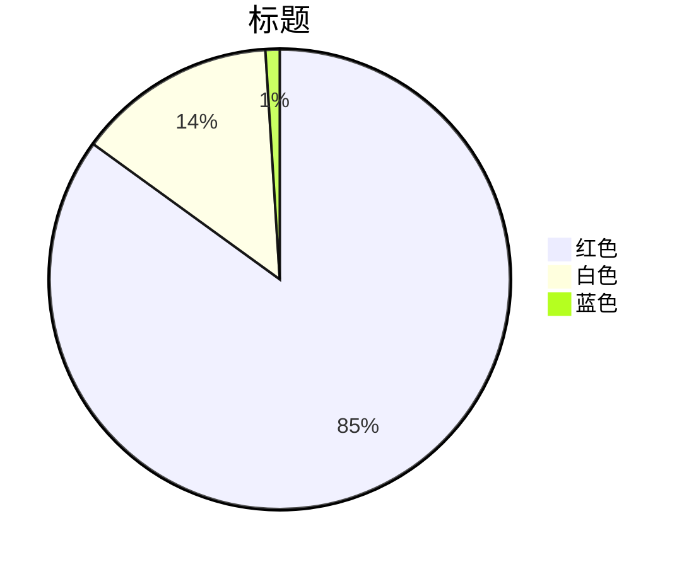

## <font color="yellow">昨日学习内容复习</font>
1.  标题
2. ***dsljkl***
3. <u> underline</U>
4. ~~kkljfklfd
5. ==fklaklj==
6. <font color ="white"> 白色字体</font>
7. 分层
	djlkjlj
	doff
		djljfdljfl
		fklflfjlk
8. > 引用
---


10. 



A-->B



10. 表格
| 必须 | 要有 | 表头|
| :- | :- :| -:|
 [TOC]
 11. 双链 [[flow chart|流程图]]
 12.  pie chart

 ``` mermaid
 pie title
 title test
 "red":85
 "green":15
```
## <font color="yellow">今日学习内容</font>
	1. mermaid grammer flow chart and pie chart
	2. tencent cloud cos 使用 建立存储桶 
	3. 

	4. Git
		- git的作用
		- 
## <font color="yellow">特殊事件</font>
## <font color="yellow">英语单词</font>
1. 单词复习
	- mermaid
	- palette command palette
	- slope
	- ramp
	- clamp
	- slope compensation
1. 今日单词


	1. my private warehouse