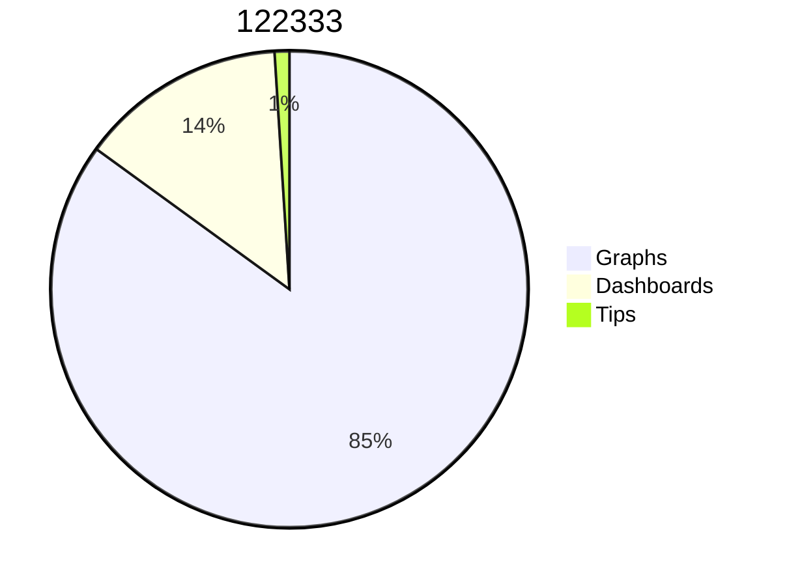
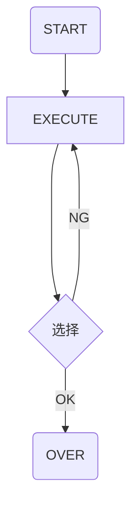

## 昨日学习内容复习
>1. 标题
>2. **加粗**  *斜线*  <u> 下划线</U>  ~~删除线~~  
>3. ***
>4. OUTLINE
>5.  绿色 

class Square~Shape~{
            int id
            List~int~ position
            setPoints(List~int~ points)
            getPoints() List~int~
        }
        
        Square : -List~string~ messages
        Square : +setMessages(List~string~ messages)
        Square : +getMessages() List~string~

|TABLE1| AAA|B|
|:-:|-:|:-|

腾讯COS 实现图床

GIT 分布布是版本管理系统 每个用户本地都有完整的系统
SVN 集中式版本管理系统
git 本地文件  add 缓存区  
## 今日学习内容
## 特殊事件
## 英语单词
1. 单词复习
	- repository
	- palette
	- slope compensation
	- ramp
	- clamp
	- Vietnam
	- Mercury
	- Venus
	- Earth
	- Mars
	- Jupiter
	- Saturn
	- Uranus
	- Neptune
1. 今日单词

- 19:26 逼自己，你必须要行动起来，将焦虑等抛在脑后，你必须要做出选择，自己的选择，坚定不移的朝目标前进是你唯一的出路#加油
- 20:10 我的最低目标 离家近，回武汉可以多接触亲戚朋友 能够交心的好朋友很重要，多说话，学会多找话题，让人觉得你很喜欢开口说话很重要，多和人打招呼，让人觉得你亲切没有架子 做人要自私一点，对自己狠一点 第一份工作工资可以低一点，以9k为目标。