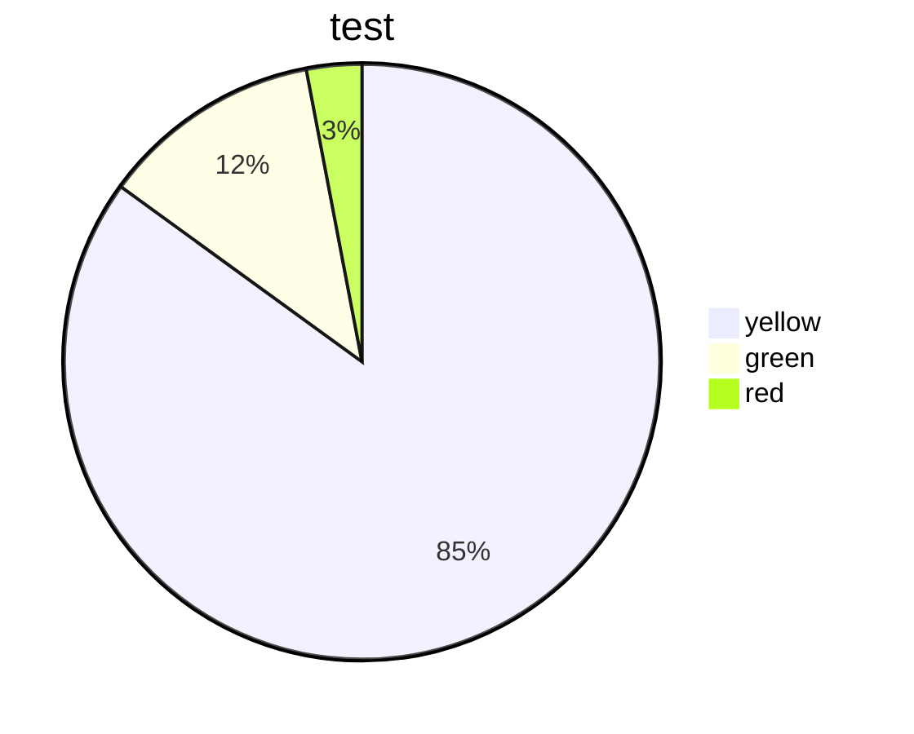

## <font color="yellow">昨日学习内容复习</font>
1. markdown grammer
	-  ## title
	- **加粗**    *斜线*    ==light==  <u> underline </U>    ~~kdkjdk    
	- *** 分割线
	- > 引用
	- - [X] LKLKKL
	- 

2. mermaid 话流程图


3. mermaid flowchart
	``` mermaid
	flowchart LR
	A(START)-->B[EXETUE]-->C{CHOICE}-->|OK|D((END))
    ```


- [X] DSKLLKJL
Latex syntax
$f(x) = 3x + 7$
$$f(x) = 3x +9$$


## <font color="yellow">今日学习内容</font>
<<<<<<< HEAD
1. 电容器
	1F 给1v电压可储存1Q电量 
	电容表示电容器存储电荷的能力
	$$ Q = C U $$
	$$ 1F=10^3mF=10^6 uF =10^9nF = 10^{12}pF $$
	实际电容寄生电阻ESR 寄生电感 ESL
	电容受温度影响
	实际电容与标称电容之间的差称为标称误差
	漏电流 电解电容漏电流较大 其他电解电容漏电流较小  
	电容的频率特性
	由于ESL的存在与C一起构成了一个谐振电路
	旁路电容  如果电容起的主要作用是给交流信号提供低阻抗的通路，就成为旁路电容 旁路电容的一般并在主要器件两端，滤除交流成分 旁路电容的常用电容数量级就是0.1uF
	去耦：增加电源与地的交流耦合，减少交流信号对地的影响
	自举电容
	RC吸收电路
	
	
	
	
	
	
1.  高等数学
	- 求导  $$ f'(x)={\lim_{h\to 0}}(f(h+x)-f(x))/h$$
	- 微分$$dy = f'(x)\Delta x$$
	- 不定积分 $$\int{f(x)}{dx}=F(x) +C$$
	- [欧拉公式]([宝藏！欧拉公式如此直观易懂！ - 知乎 (zhihu.com)](https://zhuanlan.zhihu.com/p/534742027))$$e^i \theta =cos\theta+sin\theta i$$


=======
1. 开关电源中的磁性元器件
	- 能够保持磁性的磁性物质被称为永久磁铁
	- 永久磁铁的磁性就是分子电流产生的，磁性材料原子内的电子围绕原子核旋转和自转所形成，电子运动形成一个个小小的磁体，这些小磁体在晶格中排列在一个方向，形成一个个小的磁区
	- 左手力 右手磁
	- 磁场感应强度B 单位T tesla  $$1T = {1N/(1A . 1m)}$$  只与电流 距离电流的位置有关  磁通线密度
	- 磁通量 通过某截面的磁通线 的总量$$\phi$$ 单位Wb   1 Wb=1T . 1m^2
	- 磁导率u   代表磁介质导磁的能力  电流在不同介质中产生的磁感应强度
- 
	- 是不同的
	- 磁场强度H = B/u
	- 安培环路定律： 安培发现在电流产生的磁场当中，矢量H沿任意闭合去线的积分等于此闭合曲线所包围的所有电流的代数和
	
>>>>>>> master
## <font color="yellow">特殊事件</font>
## <font color="yellow">英语单词</font>
1. 单词复习
	- the congress is eager to protect and enhance their reputation
	- conflict
	- make a resolution
	- Mercury
	- Venus
	- Earth
	- Mars
	- Jupiter
	- Saturn
	- Uranus
	- Neptune
	- Vietnam
	- astronaut
	- copilot
	- Syntax 
	- command palette
	- repository

1. 今日单词


- 21:40 要学会发展你的第二副业，以保证你在失业的时候不会慌#emotion<br>
```flow
st=>start: Start
op=>operation: Your Operation
cond=>condition: Yes or No?
e=>end

st->op->cond
cond(yes)->e
cond(no)->op
```
