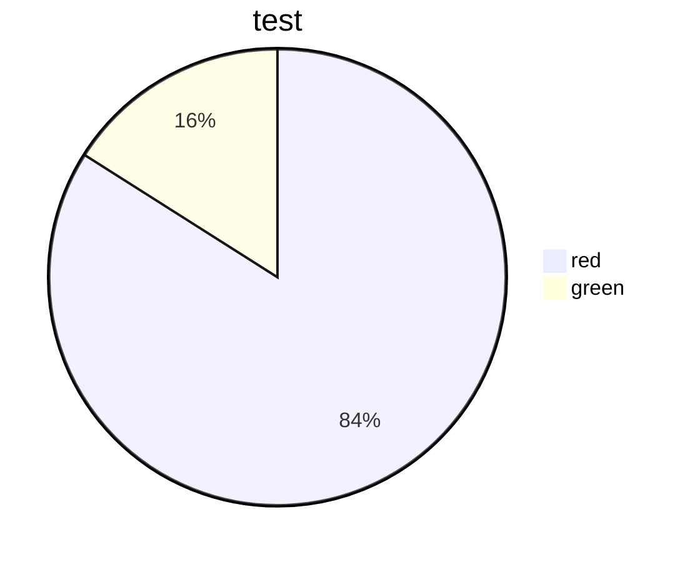
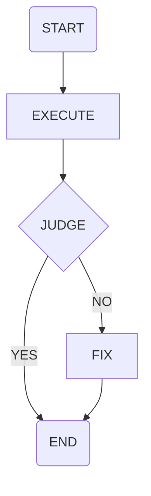

## 昨日学习内容复习
### OBSIDIAN 使用
1. **加粗**   *倾斜*    ~~删除线   
2. <u>underline</U>    ==highlight 
3. ---
4. red font 
5. 标题
6. 分层 > tab  1.  - 
7. 引用 >
>cite

8. 代码块

9. 插入网站 [百度](www.baidu.com)
10. - [x] 
- [x] sljdl;lkl
- [x] sljalklk
1. 图片

2. [[2023-03-31-Fri#特殊事件|3.31]]

 |TABLE|TABLE HEAD|TABLE HEAD|
 |-:|:-:|:-|

## 今日学习内容
## 特殊事件
## 英语单词
1. 单词复习
2. 今日单词

